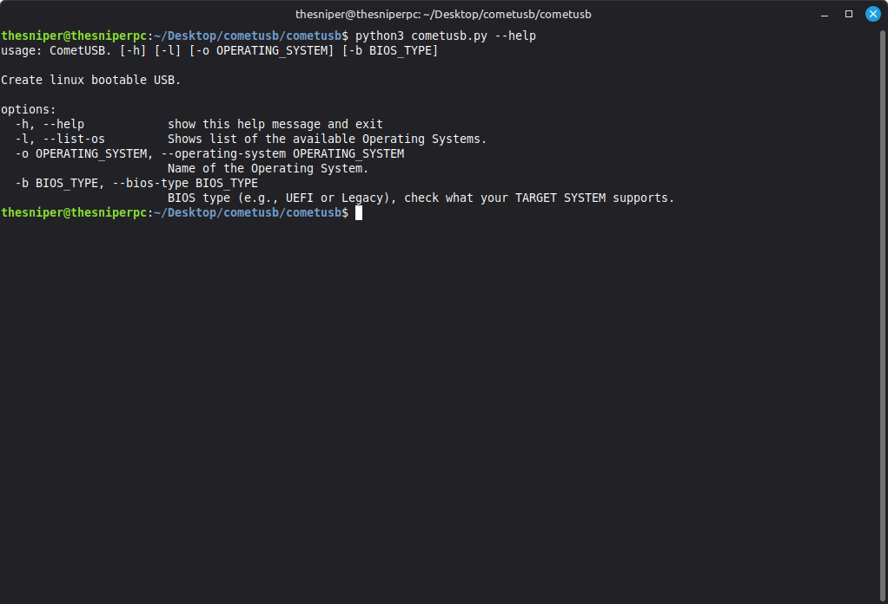

# CLI Reference

### Required Arguments

| Option | Long Option | Description | Example |
| :--- | :--- | :--- | :--- |
| `-o` | `--operating-system` | **Name of the Operating System** to download and install.| `-o linuxmint` |
| `-b` | `--bios-type` | **BIOS type** (boot mode) for the target system. Specifies the partitioning scheme (GPT/MBR) and GRUB installation method. | `-b uefi` |

### Optional Arguments

| Option | Long Option | Description |
| :--- | :--- | :--- |
| `-l` | `--list-os` | Shows a list of the currently available and supported Operating Systems. |
| `-h` | `--help` | Show the help message and exit. |
